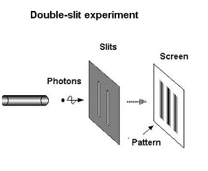
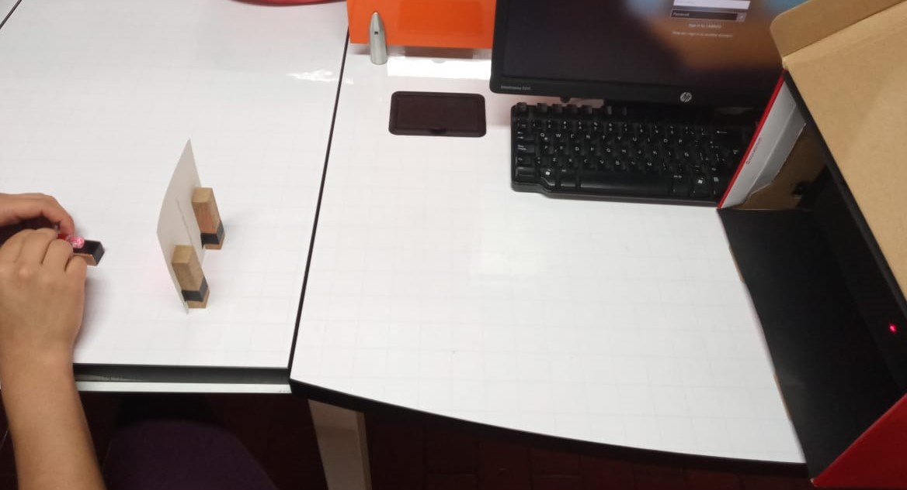
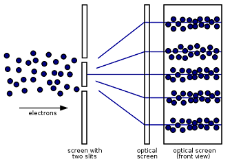

# Experimento de la Doble Rendija 

## Descripción 

En el experimento de la doble rendija, un láser emite luz que se dirige a dos rendijas paralelas, entonces se observará un pronunciado patrón de interferencia similar a una franja.En donde se muestran una serie de bandas claras y oscuras, más pronunciadas cuando las ranuras se hacen más estrechas.

## Experimento

Se creó un modelo del experiemnto con un láser atado a una base para mantenerlo firme, una cartiluna con dos rendijas por las que atraviesa la luz del láser y un fondo negro que permite ver el patrón que se crea cuando la luz atraviesa las rejillas.

* Modelo del experimento -video

 

### Resultado obtenido: 

Se genero en el fondo el siguiente patrón cuando la luz atraviesa la rendija.

##  Explicación

Ampliando la idea del experimento, es posible construir un experimento en el que se emite sólo un fotón a la vez. Cuando una sucesión de ellos separados por una cantidad definida de tiempo se dirige a través de ambas ranuras para golpear una pantalla fotosensible, aparecen puntos únicos. Esto es lo esperado porque los fotones individuales se disparan a través de las ranuras, por lo que no pueden dar lugar a un patrón de interferencia. Y sin embargo, lo que es extraño de todo esto es que si se hace que el proceso continúe hasta que se acumulen muchos puntos en la pantalla, surge un patrón de interferencia discernible definitivo.

La explicación posible es que los electrones individuales, separados en el tiempo, pasan por ambas ranuras. Lo que significa que el electron interfiere con sus propias historias de otros universos. Esta imposibilidad física es la manera de explicar el patrón de interferencia.

## Creadores

* Karen Paola Duran Vivas
* Andres Camilo Villamil
* Valentina Siabatto Rojas

    *Estudiantes Escuela Colombiana de Ingeniería Julio Garavito* 

## Referencias 

* S. Yanofsky, N., & A. Mannucci, M. (2008). Quantum Computing for Computer Scientists. New York: Cambridge University Press.

* Herres,D (mayo 15, 2015). Thomas Young and the double-slit experiment. Lugar de publicación:Test&MeasurementTips. Disponible en: https://www.testandmeasurementtips.com/thomas-young-and-the-double-slit-experiment/

* Tonomura, Akira (2008). *Single electron double slit wave experiment.* Disponible en: https://www.youtube.com/watch?v=ZJ-0PBRuthc

