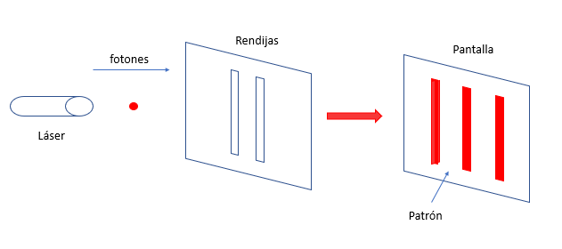
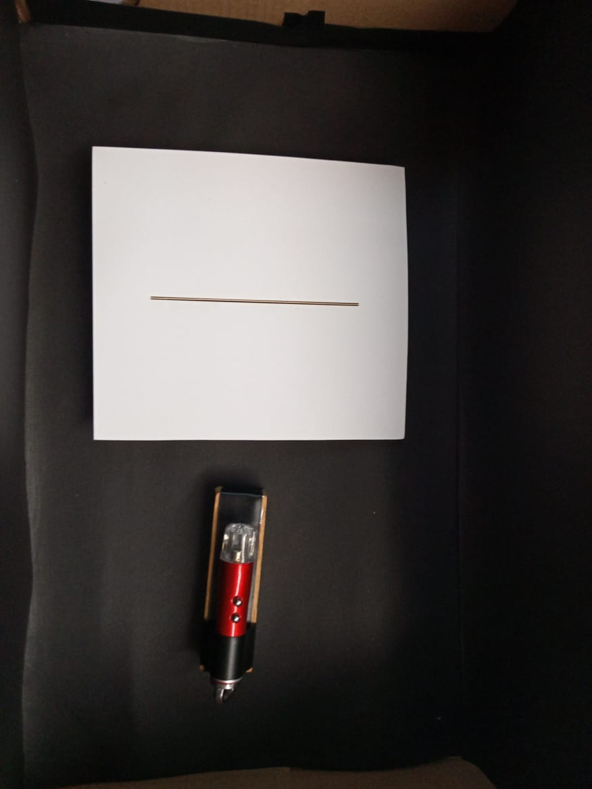
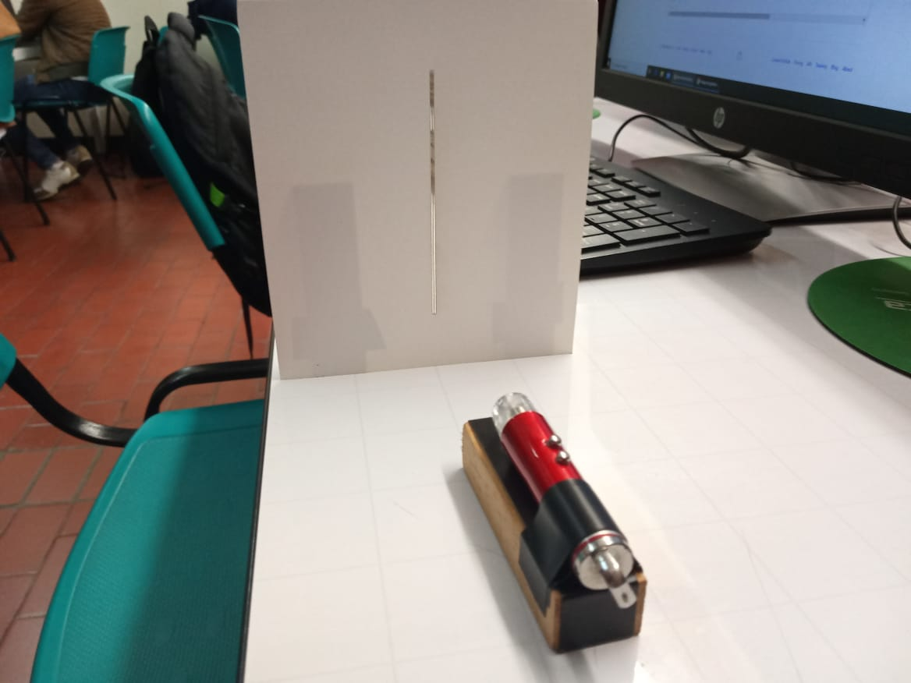
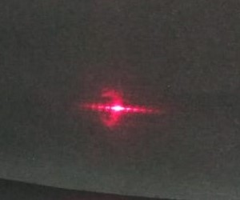
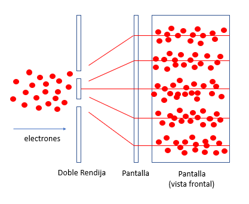
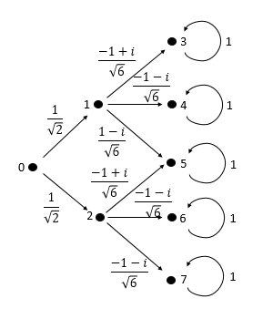
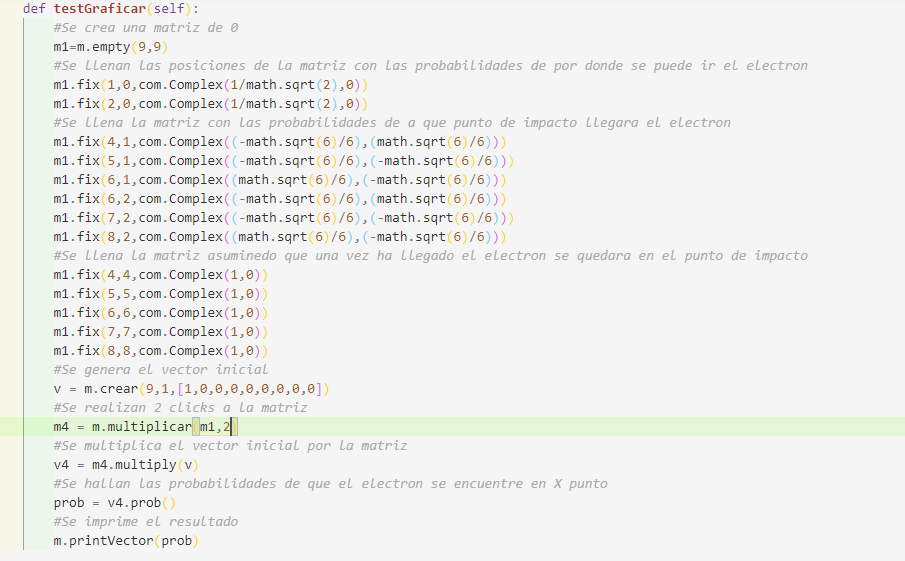
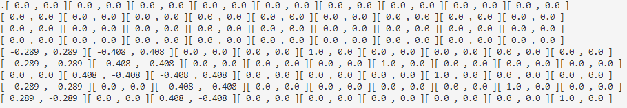
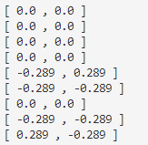
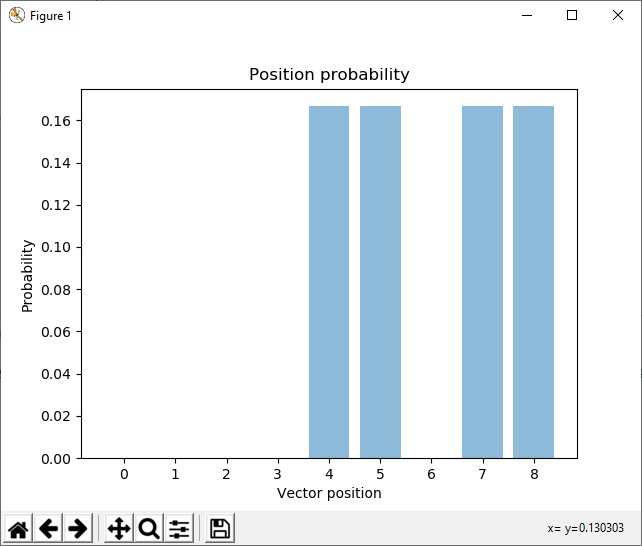

# Experimento de la Doble Rendija 

## Descripción 

En el experimento de la doble rendija, un láser emite luz que se dirige a dos rendijas paralelas, entonces se observará un pronunciado patrón de interferencia similar a una franja.En donde se muestran una serie de bandas claras y oscuras, más pronunciadas cuando las ranuras se hacen más estrechas.

## Experimento

### Materiales
* Laser sujetado a una base
* Rendija en hoja de papel
* Caja arreglada para una mejor percepcion de la luz
 

### Procedimiento
Primero se realizo el corte para la rendija en la hoja de papel y se sujetaron tanto el laser como la rendija sus respectivas bases.

 

Posteriormente se ajusto la caja negra una distancia de aproximadamente 1 metro y se disparo el laser a travez de la rendija lo que permitio evidenciar el patron de interferencia de la luz.

* Modelo del experimento -video

 

### Resultado obtenido: 

Se genero en el fondo el siguiente patrón cuando la luz atraviesa la rendija.

##  Explicación

Ampliando la idea del experimento, es posible construir un experimento en el que se emite sólo un fotón a la vez. Cuando una sucesión de ellos separados por una cantidad definida de tiempo se dirige a través de ambas ranuras para golpear una pantalla fotosensible, aparecen puntos únicos. Esto es lo esperado porque los fotones individuales se disparan a través de las ranuras, por lo que no pueden dar lugar a un patrón de interferencia. Y sin embargo, lo que es extraño de todo esto es que si se hace que el proceso continúe hasta que se acumulen muchos puntos en la pantalla, surge un patrón de interferencia discernible definitivo.

La explicación posible es que los electrones individuales, separados en el tiempo, pasan por ambas ranuras. Lo que significa que el electron interfiere con sus propias historias de otros universos. Esta imposibilidad física es la manera de explicar el patrón de interferencia.

## Simulación
Mediante la librearia de numeros copmplejos se ha realizado una simulacion del experimento.

* Grafo que describe la simulación
 

 

* Codigo de la simulación
 

 

* Matriz luego de 2 clicks de tiempo
 

 

* Vector resultante
 

   
 

* Grafica resultante
 

 

## Creadores

* Karen Paola Duran Vivas
* Andres Camilo Villamil
* Valentina Siabatto Rojas

    *Estudiantes Escuela Colombiana de Ingeniería Julio Garavito* 

## Referencias 

* S. Yanofsky, N., & A. Mannucci, M. (2008). Quantum Computing for Computer Scientists. New York: Cambridge University Press.

* Herres,D (mayo 15, 2015). Thomas Young and the double-slit experiment. Lugar de publicación:Test&MeasurementTips. Disponible en: https://www.testandmeasurementtips.com/thomas-young-and-the-double-slit-experiment/

* Tonomura, Akira (2008). *Single electron double slit wave experiment.* Disponible en: https://www.youtube.com/watch?v=ZJ-0PBRuthc

